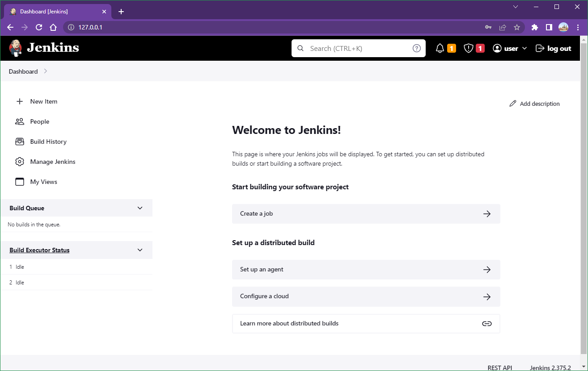
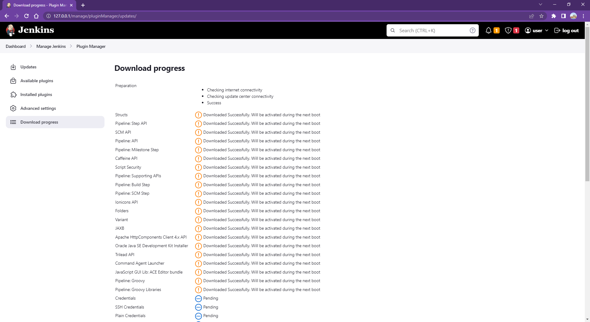
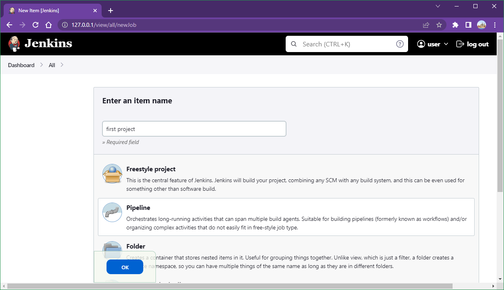
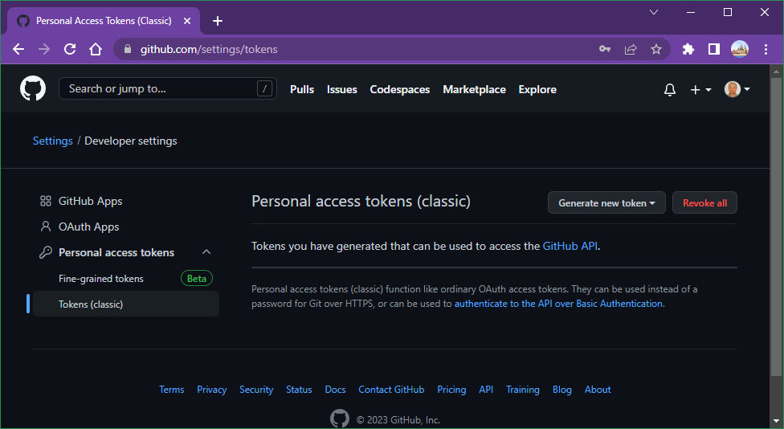
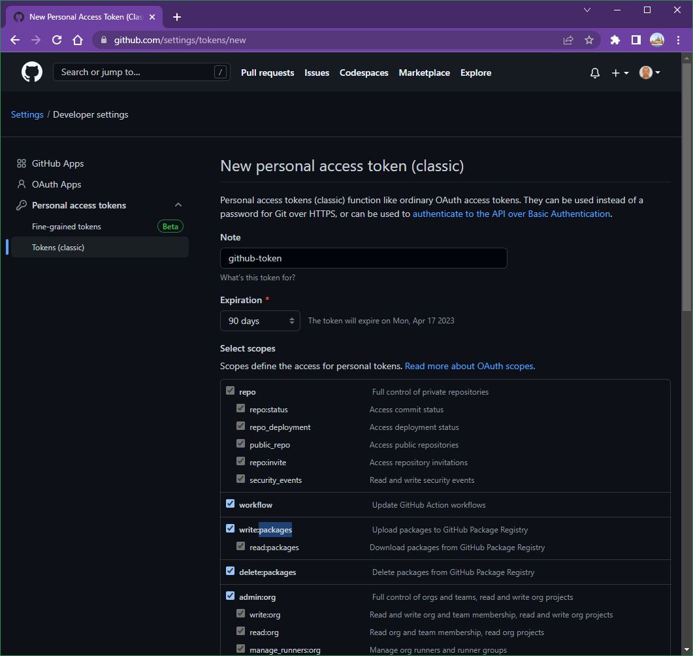
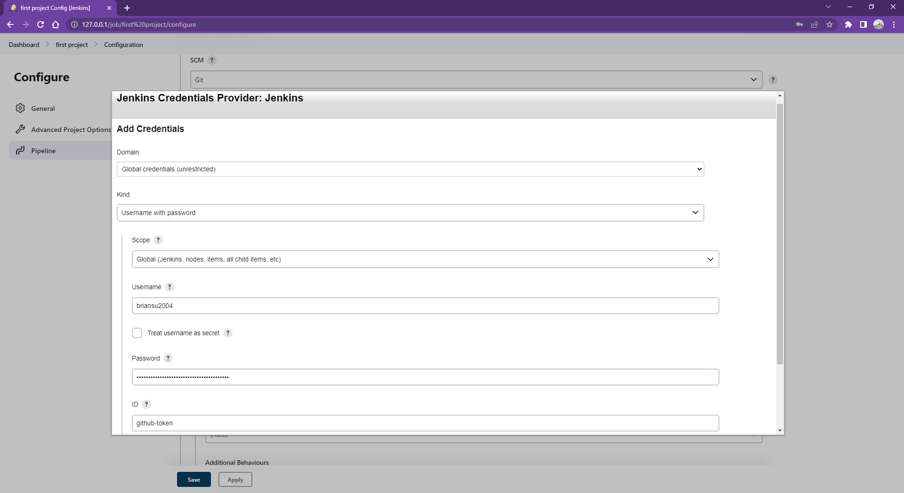
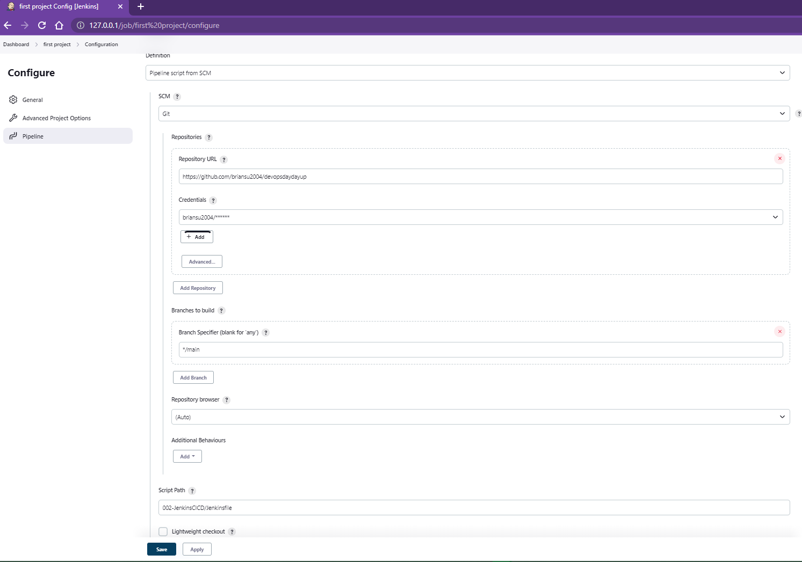
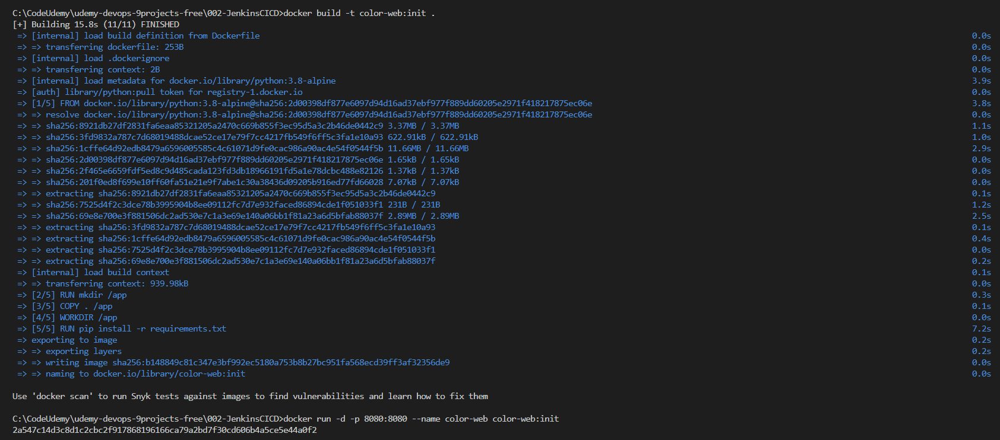

# Project 002: Jenkins CICD Pipeline

Windows only

???

## Steps

1. Deploy a Jenkins docker container with **docker-compose**

```bash
git clone https://github.com/briansu2004/udemy-devops-9projects-free.git
cd udemy-devops-9projects-free//002-JenkinsCICD
docker-compose up -d
```

2. Open your **browser** and go to the Jenkins UI website (<http://<JenkinsHostIP>>).

If you install the Jenkins in your local host, you can go [here](http://127.0.0.1) or [here](http://0.0.0.0).

Login to the Jenkins with the username/password defined in your `docker-compose.yaml`.



3. Go to **"Manage Jenkins"** in the left lane and go to **"Manage Plugins"**. Click **"Available"** tab in the **"Plugin Manager"** page and type **"pipeline"** in the search bar. Select **"Pipeline"** and click **"Download now and install after restart"**.



4. Follow the same step above and install **"git"** and **"Docker Pipeline"** as plugins.

5. Once the plugin is installed and the Jenkins is restarted, go to the main page of the Jenkins website and click **"New Item"** in the left. Type the name of your project (i.g. first-project) and select **"Pipeline"** and click **"OK"**. In the Configuration page, make sure below fields in **"Pipeline"** section are filled:



    a. **"Definition"**: select "Pipeline script from SCM"

    b. **"SCM"**: select "Git"

    c. **"Repository URL"**: Enter the URL of the repo which has Jenkinsfile, for example, <https://github.com/briansu2004/devopsdaydayup>. (Note: You can fork "devopsdaydayup" repo to your github account and enter the URL accordingly)

    d. **"Credentials"**: If you don't have any credential, click "Add" -> "Jenkins", in "Kind" field select "Username with password". In "Scope" field select "Global(Jenkins, nodes, items, all child items, etc)". In "Username", type your github account username. In "Password", type your github account token.

    **Note**: In order to get a github token, you can go to your github account and select **"Setting"** once you click your account icon in the top right. Go to **"Developer settings"** in the very bottom left lane and go to **"Personal access tokens"** -> **"Tokens(classic)"**, and then click "Generate new token" to create a new token for above step, making sure the token has at lease `write:packages` and `read:packages` so that it can upload/download packages to GitHub Package Registry.







    e. **"ID"**: Enter the name of this credential, which will be referred in the Pipeline later. For example, github-token.

    f. **"Branch Specifier (blank for 'any')"**: Enter the branch which has your Jenkinsfile, for example, `*/main`

    g. **"Script Path"**: Enter the relative path for the Jenkinsfile in your repo, for example, 002-JenkinsCICD/Jenkinsfile

    h. Unselect **"Lightweight checkout"**



Save above change.

1. Run a container **before** trigger your pipeline

```bash
docker build -t color-web:init .
docker run -d -p 8080:8080 --name color-web color-web:init
```

```bash
docker ps -aqf "name=002-jenkinscicd-jenkins-1"

docker exec <jenkins_container> chmod 777 /var/run/docker.sock
```



1. Click **"Build"** to trigger your first pipeline

2. You should be able to see the hello world page in [here](http://localhost:8080)

3. Make a change into `app.py`. For example, change "Hello world" to "Hello world 2". And then click "Build" again to trigger the pipeline to deploy the change. Once it is done, you should be able to see your change in [here](http://localhost:8080)

## Troubleshooting

### Issue 1:  No such property: docker for class

When you run the pipeline, it fails with below error:

```bash
groovy.lang.MissingPropertyException: No such property: docker for class: groovy.lang.Binding
 at groovy.lang.Binding.getVariable(Binding.java:63)
 at org.jenkinsci.plugins.scriptsecurity.sandbox.groovy.SandboxInterceptor.onGetProperty(SandboxInterceptor.java:251)
 at org.kohsuke.groovy.sandbox.impl.Checker$7.call(Checker.java:353)
 at org.kohsuke.groovy.sandbox.impl.Checker.checkedGetProperty(Checker.java:357)
 at org.kohsuke.groovy.sandbox.impl.Checker.checkedGetProperty(Checker.java:333)
 at org.kohsuke.groovy.sandbox.impl.Checker.checkedGetProperty(Checker.java:333)
 at org.kohsuke.groovy.sandbox.impl.Checker.checkedGetProperty(Checker.java:333)
 at com.cloudbees.groovy.cps.sandbox.SandboxInvoker.getProperty(SandboxInvoker.java:29)
 at com.cloudbees.groovy.cps.impl.PropertyAccessBlock.rawGet(PropertyAccessBlock.java:20)
 at WorkflowScript.run(WorkflowScript:16)
 at ___cps.transform___(Native Method)
 at com.cloudbees.groovy.cps.impl.PropertyishBlock$ContinuationImpl.get(PropertyishBlock.java:74)
 at com.cloudbees.groovy.cps.LValueBlock$GetAdapter.receive(LValueBlock.java:30)
 at com.cloudbees.groovy.cps.impl.PropertyishBlock$ContinuationImpl.fixName(PropertyishBlock.java:66)
 at jdk.internal.reflect.GeneratedMethodAccessor118.invoke(Unknown Source)
 at java.base/jdk.internal.reflect.DelegatingMethodAccessorImpl.invoke(DelegatingMethodAccessorImpl.java:43)
 at java.base/java.lang.reflect.Method.invoke(Method.java:566)
 at com.cloudbees.groovy.cps.impl.ContinuationPtr$ContinuationImpl.receive(ContinuationPtr.java:72)
 at com.cloudbees.groovy.cps.impl.ConstantBlock.eval(ConstantBlock.java:21)
 at com.cloudbees.groovy.cps.Next.step(Next.java:83)
 at com.cloudbees.groovy.cps.Continuable$1.call(Continuable.java:174)
 at com.cloudbees.groovy.cps.Continuable$1.call(Continuable.java:163)
 at org.codehaus.groovy.runtime.GroovyCategorySupport$ThreadCategoryInfo.use(GroovyCategorySupport.java:136)
 at org.codehaus.groovy.runtime.GroovyCategorySupport.use(GroovyCategorySupport.java:275)
 at com.cloudbees.groovy.cps.Continuable.run0(Continuable.java:163)
 at org.jenkinsci.plugins.workflow.cps.SandboxContinuable.access$001(SandboxContinuable.java:18)
 at org.jenkinsci.plugins.workflow.cps.SandboxContinuable.run0(SandboxContinuable.java:51)
 at org.jenkinsci.plugins.workflow.cps.CpsThread.runNextChunk(CpsThread.java:187)
 at org.jenkinsci.plugins.workflow.cps.CpsThreadGroup.run(CpsThreadGroup.java:420)
 at org.jenkinsci.plugins.workflow.cps.CpsThreadGroup.access$400(CpsThreadGroup.java:95)
 at org.jenkinsci.plugins.workflow.cps.CpsThreadGroup$2.call(CpsThreadGroup.java:330)
 at org.jenkinsci.plugins.workflow.cps.CpsThreadGroup$2.call(CpsThreadGroup.java:294)
 at org.jenkinsci.plugins.workflow.cps.CpsVmExecutorService$2.call(CpsVmExecutorService.java:67)
 at java.base/java.util.concurrent.FutureTask.run(FutureTask.java:264)
 at hudson.remoting.SingleLaneExecutorService$1.run(SingleLaneExecutorService.java:139)
 at jenkins.util.ContextResettingExecutorService$1.run(ContextResettingExecutorService.java:30)
 at jenkins.security.ImpersonatingExecutorService$1.run(ImpersonatingExecutorService.java:70)
 at java.base/java.util.concurrent.Executors$RunnableAdapter.call(Executors.java:515)
 at java.base/java.util.concurrent.FutureTask.run(FutureTask.java:264)
 at java.base/java.util.concurrent.ThreadPoolExecutor.runWorker(ThreadPoolExecutor.java:1128)
 at java.base/java.util.concurrent.ThreadPoolExecutor$Worker.run(ThreadPoolExecutor.java:628)
 at java.base/java.lang.Thread.run(Thread.java:829)
Finished: FAILURE
```

**Solution:**
Make sure "Docker-Pipeline" plugin is installed

### Issue 2: Error response from daemon: No such container: color-web

When running the pipeline, below error is showed

```bash
+ docker stop color-web
Error response from daemon: No such container: color-web
[Pipeline] }
[Pipeline] // stage
[Pipeline] stage
[Pipeline] { (Clean Up)
Stage "Clean Up" skipped due to earlier failure(s)
[Pipeline] }
[Pipeline] // stage
[Pipeline] }
[Pipeline] // withEnv
[Pipeline] }
[Pipeline] // withEnv
[Pipeline] }
[Pipeline] // node
[Pipeline] End of Pipeline
ERROR: script returned exit code 1
Finished: FAILURE
```

**Solution:**
Make sure the `color-web` container is running

```bash
docker run -p 8080:8080 --name color-web color-web:init
```

### Issue 3: Cannot run docker inside of Jenkins pipeline job container

**Solution:**
Run below command to grant access to `docker.sock` for the Jenkins pipeline job container

```bash
docker exec <jenkinsContainerID> chmod 777 /var/run/docker.sock
```

### Issue 4:  Jenkins error buildind : docker: /lib/x86_64-linux-gnu/libc.so.6: version `GLIBC_2.32' not found (required by docker)

When running Jenkins pipeline to build docker image, it shows below error

```bash
Jenkins error buildind : docker: /lib/x86_64-linux-gnu/libc.so.6: version `GLIBC_2.32' not found (required by docker)
```

**Cause:**
The issue will occur when you are using Ubuntu 22.02 (Ubuntu 20.02 is working fine). you’ve having shared-library issues because you’re injecting a docker binary that depends on a different version of GNU libc than exists in the image.

**Solution:**
You can build a customed image with seperated docker component/lib installed and then use this image for your Jenkins deployment.

Dockerfile

```bash
FROM jenkins/jenkins:lts-jdk17
USER root
RUN apt-get update \
 && DEBIAN_FRONTEND=noninteractive \
    apt-get install --no-install-recommends --assume-yes \
      docker.io
USER jenkins
```

docker-compose.yaml

```yml
version: '3.8'
services:
  jenkins-container:
    build: .
    # no image:
    volumes:
      - ./data:/var/jenkins_home
      # but not /usr/bin/docker
```

### Issue 5: ERROR: Failed to program FILTER chain: iptables failed: iptables --wait -I FORWARD -o br-6a98sdf0s -j DOCKER: iptables v1.4.21: Couldn't load target : No such file or directory

When creating the docker-compose, above error showing
**Solution:**
Restart your docker engine and try to create again

```bash
sudo systemctl restart docker
```

> Refer to <https://jtuto.com/getting-glibc_2-32-and-glibc_2-34-not-found-in-jenkins-docker-with-dind-on-ubuntu-22-04/>
