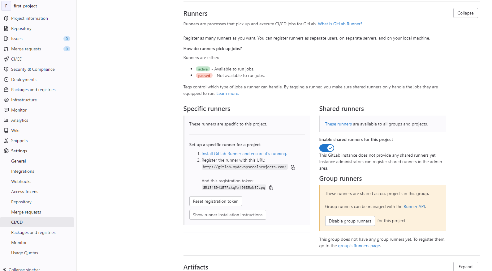
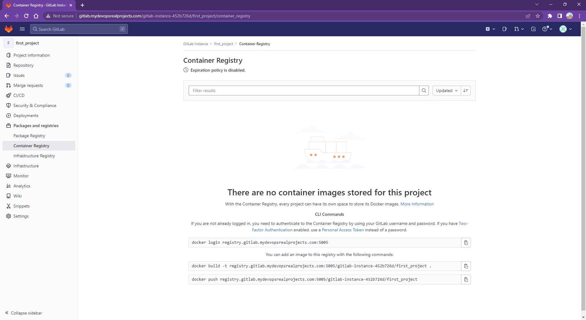

# Project 003: Gitlab CICD Pipeline

Windows + Ubuntu

Works

## Steps

## 1. Config the gitlab_domain_name

In this lab, we will use `mydevopsrealprojects.com` as the gitlab_domain_name.

Hence the gitlab instance URL is `http://gitlab.mydevopsrealprojects.com`

`docker-compose.yml`

## 2. Configure the **hosts** file

Windows: `C:\Windows\System32\drivers\etc\hosts`

In local Windows's hosts file `C:\Windows\System32\drivers\etc\hosts`

```dos
192.168.33.10 gitlab.mydevopsrealprojects.com
192.168.33.10 registry.gitlab.mydevopsrealprojects.com
```

Unix / Mac: `/etc/hosts`

In Vagrant Ubuntu's hosts file `/etc/hosts`

```bash
127.0.0.1 gitlab.mydevopsrealprojects.com
127.0.0.1 registry.gitlab.mydevopsrealprojects.com
```

## 3. Config the initial root password

```yml
    hostname: 'gitlab.mydevopsrealprojects.com'
    environment:
      GITLAB_ROOT_PASSWORD: "Password2023#"
      EXTERNAL_URL: "http://gitlab.mydevopsrealprojects.com"
      GITLAB_OMNIBUS_CONFIG: |
        gitlab_rails['initial_root_password'] = "Password2023#"
```

## 4. Docker compose

Docker login with the GitHub token

```dos
docker login ghcr.io -u briansu2004
```

Docker compose

```dos
git clone https://github.com/briansu2004/udemy-devops-9projects-free.git
cd udemy-devops-9projects-free/003-GitlabCICD
docker compose up -d
```

## 5. Login to your GitLab web

Wait for about **5 mins** for the server to fully start up.

Then go to [http://gitlab.mydevopsrealprojects.com](http://gitlab.mydevopsrealprojects.com) and login the username `root` and the password.

## 6. get the GitLab registration token

Click **"New project"** to create your first project

-> Click **"Create blank project"**

-> Type your project name in **"Project Name"**

-> Select **"Public"**

-> Click **"Create project"**

-> Go to the new project you just created, and **"Setting"** -> **"CI/CD"**

-> Expand **"Runners"** section.

-> **Make a note** of **"URL** and **registration token** in **"Specific runners"** section for below runner installation used.


Register the runner with this URL:

<http://gitlab.mydevopsrealprojects.com/>

And this registration token:

`GR1348941B7RskqMxf9685xNEJzpq`



## 7. Update certificates

Since the initial Gitlab server **certificate** is missing some info and cannot be used by gitlab runner, we may have to **regenerate** a new one and **reconfigure** in the gitlab server. Run below commands:

```dos
docker exec -it $(docker ps -f name=web -q) bash
mkdir /etc/gitlab/ssl
cd /etc/gitlab/ssl
openssl genrsa -out ca.key 2048
openssl req -new -x509 -days 365 -key ca.key -subj "/C=CN/ST=GD/L=SZ/O=Acme, Inc./CN=Acme Root CA" -out ca.crt
export YOUR_GITLAB_DOMAIN=mydevopsrealprojects.com
echo $YOUR_GITLAB_DOMAIN
openssl req -newkey rsa:2048 -nodes -keyout gitlab.$YOUR_GITLAB_DOMAIN.key -subj "/C=CN/ST=GD/L=SZ/O=Acme, Inc./CN=*.$YOUR_GITLAB_DOMAIN" -out gitlab.$YOUR_GITLAB_DOMAIN.csr
openssl x509 -req -extfile <(printf "subjectAltName=DNS:$YOUR_GITLAB_DOMAIN,DNS:gitlab.$YOUR_GITLAB_DOMAIN") -days 365 -in gitlab.$YOUR_GITLAB_DOMAIN.csr -CA ca.crt -CAkey ca.key -CAcreateserial -out gitlab.$YOUR_GITLAB_DOMAIN.crt
ls -l
```

Certificate for nginx (container registry)

```dos
openssl req -newkey rsa:2048 -nodes -keyout registry.gitlab.$YOUR_GITLAB_DOMAIN.key -subj "/C=CN/ST=GD/L=SZ/O=Acme, Inc./CN=*.$YOUR_GITLAB_DOMAIN" -out registry.gitlab.$YOUR_GITLAB_DOMAIN.csr
openssl x509 -req -extfile <(printf "subjectAltName=DNS:$YOUR_GITLAB_DOMAIN,DNS:gitlab.$YOUR_GITLAB_DOMAIN,DNS:registry.gitlab.$YOUR_GITLAB_DOMAIN") -days 365 -in registry.gitlab.$YOUR_GITLAB_DOMAIN.csr -CA ca.crt -CAkey ca.key -CAcreateserial -out registry.gitlab.$YOUR_GITLAB_DOMAIN.crt
ls -l
cat gitlab.$YOUR_GITLAB_DOMAIN.crt
cat registry.gitlab.$YOUR_GITLAB_DOMAIN.crt
exit
```

```bash
root@gitlab:/etc/gitlab/ssl# cat gitlab.$YOUR_GITLAB_DOMAIN.crt
-----BEGIN CERTIFICATE-----
MIIDijCCAnKgAwIBAgIUQRt4YrO0Pvw8oXPhHFQ7JlleJ7swDQYJKoZIhvcNAQEL
BQAwUzELMAkGA1UEBhMCQ04xCzAJBgNVBAgMAkdEMQswCQYDVQQHDAJTWjETMBEG
A1UECgwKQWNtZSwgSW5jLjEVMBMGA1UEAwwMQWNtZSBSb290IENBMB4XDTIzMDEy
MTIxMTAxNFoXDTI0MDEyMTIxMTAxNFowYTELMAkGA1UEBhMCQ04xCzAJBgNVBAgM
AkdEMQswCQYDVQQHDAJTWjETMBEGA1UECgwKQWNtZSwgSW5jLjEjMCEGA1UEAwwa
Ki5teWRldm9wc3JlYWxwcm9qZWN0cy5jb20wggEiMA0GCSqGSIb3DQEBAQUAA4IB
DwAwggEKAoIBAQDT9CNE8dwsDMF3QYSpsfTOeUwh/4U4b92VCzniwlpITxf7Tvwu
7D39to7yDbwNl8JNBR7dCqdgeRljLiswW7G1UhQJ+hh7hYTrypTfrkWM/J759kpo
y6PjuaEU9MVPfk00LR9WLuZJ8PPFK+cU+UT1IRf2xpknr+/25OrBUKJRF1EbwQgE
sIsXbTuDWlcQHnIztim5L7ie2NpzIH/weT6V7KngvhAL16HUlpUvrCfSVd7fDoZN
K7L9DJ0N+TxZ0P6ejX6NZxVeoLqNVGlbdaJjUrBhT3EGBjvXe3jevPKSoTNnO6+2
WFu6wkSzD33G0ZYtqHUtSkszxfAQ2zWkOJjVAgMBAAGjSDBGMEQGA1UdEQQ9MDuC
GG15ZGV2b3BzcmVhbHByb2plY3RzLmNvbYIfZ2l0bGFiLm15ZGV2b3BzcmVhbHBy
b2plY3RzLmNvbTANBgkqhkiG9w0BAQsFAAOCAQEAX0DV9YZqpA69N5++ANJdcSw5
lixO7j27wnwBMiX1s+eKZogXMNuCqkCe6jJkFh/QurxEfM+914ayzJBfv+F/Znjx
i8ehHdtuhlyVWRi5KwbLP9T28TnRcVo4lG1TyvdgyM4plEaRzT0U7IlKbCkbb78U
0IrsfzP33n6W5zxLv7ZpGq/YQ8A3vTxOGuxw4i9OAZedW1QA6wlcOeFaNBaST0jy
tP4uqUBrj9wTxRz/KHxxx30gFs87ZV/MK4sWGPYjzU0ENGUzeHtkfeVsmybDcq5r
s91rZfheAtlTJpraTOq2KBxx1IqSF45dNOONmmjVEMo5aECBIr3ZEO4msu3cLQ==
-----END CERTIFICATE-----

root@gitlab:/etc/gitlab/ssl# cat registry.gitlab.$YOUR_GITLAB_DOMAIN.crt
-----BEGIN CERTIFICATE-----
MIIDtDCCApygAwIBAgIUQRt4YrO0Pvw8oXPhHFQ7JlleJ7wwDQYJKoZIhvcNAQEL
BQAwUzELMAkGA1UEBhMCQ04xCzAJBgNVBAgMAkdEMQswCQYDVQQHDAJTWjETMBEG
A1UECgwKQWNtZSwgSW5jLjEVMBMGA1UEAwwMQWNtZSBSb290IENBMB4XDTIzMDEy
MTIxMTA0MloXDTI0MDEyMTIxMTA0MlowYTELMAkGA1UEBhMCQ04xCzAJBgNVBAgM
AkdEMQswCQYDVQQHDAJTWjETMBEGA1UECgwKQWNtZSwgSW5jLjEjMCEGA1UEAwwa
Ki5teWRldm9wc3JlYWxwcm9qZWN0cy5jb20wggEiMA0GCSqGSIb3DQEBAQUAA4IB
DwAwggEKAoIBAQCni7H94DdILJ1Sh7Bhb03JhSAu6em0uVBcQkK2iS0AX43e/xJ7
McNws5qbiCEjmQODalBXYkFquWRj6kwiEuHYUYqPZlce+wfLlg/f7Zrf/EE73gS2
1D3uhUEMISa34NTnUHXo87NlZ5Ybp6a/GgTwdTuVzwuD9svuGNePInKULYzeAQ6k
quOyP3gRu1Gg3qWLeQ64YuBz+ftktXmvIB9e+iKkl4Vv/2gAI9gXfxVZ50GzLmnB
r3WYRiOimg3WseVo5eNvIRsdKQLcMj9F8AvKCC37GpnzKIvTjq/nFfLnEri0T1AD
06nHEMT3TbnCLOmILZM8hkE27kuBR9x5BY2rAgMBAAGjcjBwMG4GA1UdEQRnMGWC
GG15ZGV2b3BzcmVhbHByb2plY3RzLmNvbYIfZ2l0bGFiLm15ZGV2b3BzcmVhbHBy
b2plY3RzLmNvbYIocmVnaXN0cnkuZ2l0bGFiLm15ZGV2b3BzcmVhbHByb2plY3Rz
LmNvbTANBgkqhkiG9w0BAQsFAAOCAQEAPJGP5/eAzF3wrjz8PHFDgbw9xX9iq2SF
T3r9te3gohmulGTC6HI1hBaZomGo0GffM4sl1PX+pzpMlI6m5E5iaA6/+PeuFsr/
s0/x9AemPkqGlm2cQMwrdDPss1LHuhIz+rlfuuzKWQpl3bnVK/oISpINOb1VYxYF
7eJxh86CueUqnqLTSFltUdARteW8XRu/1F2aPvqKsVdArGmOre3SLIKVcBxx3Nmw
oexqTnI9PMOmK7V0s8PYUlXTXW8UQX2X8/wMWChziwN1XlZzuhnFJZ/0e9K/LelA
ZGCHDw8t3O8UJhfMKKVBdudgspEYGrzWt7UbrekR32QLTvPpx36aQQ==
-----END CERTIFICATE-----
```

## 8. Enable container register

Add below lines in the bottom of the file `/etc/gitlab/gitlab.rb`.

```dos
docker exec -it $(docker ps -f name=web -q) bash

cat >> /etc/gitlab/gitlab.rb <<EOF

 registry_external_url 'https://registry.gitlab.$YOUR_GITLAB_DOMAIN:5005'
 gitlab_rails['registry_enabled'] = true
 gitlab_rails['registry_host'] = "registry.gitlab.$YOUR_GITLAB_DOMAIN"
 gitlab_rails['registry_port'] = "5005"
 gitlab_rails['registry_path'] = "/var/opt/gitlab/gitlab-rails/shared/registry"
 gitlab_rails['registry_api_url'] = "http://127.0.0.1:5000"
 gitlab_rails['registry_key_path'] = "/var/opt/gitlab/gitlab-rails/certificate.key"
 registry['enable'] = true
 registry['registry_http_addr'] = "127.0.0.1:5000"
 registry['log_directory'] = "/var/log/gitlab/registry"
 registry['env_directory'] = "/opt/gitlab/etc/registry/env"
 registry['env'] = {
   'SSL_CERT_DIR' => "/opt/gitlab/embedded/ssl/certs/"
 }
 # Note: Make sure to update below 'rootcertbundle' default value 'certificate.crt" to 'gitlab-registry.crt', otherwise you may get error.
 registry['rootcertbundle'] = "/var/opt/gitlab/registry/gitlab-registry.crt"
 nginx['ssl_certificate'] = "/etc/gitlab/ssl/registry.gitlab.$YOUR_GITLAB_DOMAIN.crt"
 nginx['ssl_certificate_key'] = "/etc/gitlab/ssl/registry.gitlab.$YOUR_GITLAB_DOMAIN.key"
 registry_nginx['enable'] = true
 registry_nginx['listen_port'] = 5005
EOF
```

Reconfigure the gitlab to apply above change

```dos
gitlab-ctl reconfigure
gitlab-ctl restart
exit
```

## 9. Update certificates for docker client (Skip???)

In order to make **docker login** work, we need to add the **certificate** in the docker certs folder.

```dos
# Login the host you are going to run the docker commands
# In the Vagrant Ubuntu
export YOUR_GITLAB_DOMAIN=mydevopsrealprojects.com
echo $YOUR_GITLAB_DOMAIN
sudo mkdir -p /etc/docker/certs.d/registry.gitlab.$YOUR_GITLAB_DOMAIN:5005
sudo docker cp $(docker ps -f name=web -q):/etc/gitlab/ssl/registry.gitlab.$YOUR_GITLAB_DOMAIN.crt /etc/docker/certs.d/registry.gitlab.$YOUR_GITLAB_DOMAIN:5005/
sudo ls /etc/docker/certs.d/registry.gitlab.$YOUR_GITLAB_DOMAIN:5005

# Test docker login and you should be able to login now
# Note: for Windows we can't use the default 5005 as it is blocked
docker login registry.gitlab.$YOUR_GITLAB_DOMAIN:5055 
Username: root
Password: Password2023#

WARNING! Your password will be stored unencrypted in /home/devops/.docker/config.json.
Configure a credential helper to remove this warning. See
https://docs.docker.com/engine/reference/commandline/login/#credentials-store

Login Succeeded

# You can also test if the docker image push works once login successfully
# Login to your gitlab server web UI and go to the project you created, and then go to "Packages and registries" -> "Container Registry", you should be able to see the valid registry URL you suppose to use in order to build and push your image. For example, `docker build -t registry.gitlab.devops20221020.com:5005/gitlab-instance-d350f73c/first-projct .` (See below screenshot)
```

Test if the docker image push works once login successfully -

Login to the gitlab server web UI and go to the project created, and then go to "Packages and registries" -> "Container Registry", should be able to see the valid registry URL you suppose to use in order to build and push your image.

e.g. `docker build -t registry.gitlab.mydevopsrealprojects.com:5005/gitlab-instance-d350f73c/first-projct .`



## 10. Configure **gitlab-runner**

Login to gitlab-runner and run commands below.

Please note the tag below has to match with the `tags` section in `.gitlab-ci.yml` file:

```dos
set YOUR_GITLAB_DOMAIN=mydevopsrealprojects.com
docker exec bc3466472cb3 cat /etc/gitlab/ssl/gitlab.%YOUR_GITLAB_DOMAIN%.crt
docker exec bc3466472cb3 cat /etc/gitlab/ssl/registry.gitlab.%YOUR_GITLAB_DOMAIN%.crt
```

```dos
docker exec -it 8218eac81731 bash

cat > /usr/local/share/ca-certificates/gitlab-server.crt <<EOF
# <Paste above gitlab server certificate here>
EOF

cat > /usr/local/share/ca-certificates/gitlab-server.crt <<EOF
-----BEGIN CERTIFICATE-----
MIIDijCCAnKgAwIBAgIUS4AXc0GZzSKJHSOrY8xrLNvZd7QwDQYJKoZIhvcNAQEL
BQAwUzELMAkGA1UEBhMCQ04xCzAJBgNVBAgMAkdEMQswCQYDVQQHDAJTWjETMBEG
A1UECgwKQWNtZSwgSW5jLjEVMBMGA1UEAwwMQWNtZSBSb290IENBMB4XDTIzMDEx
OTAxNDk1NVoXDTI0MDExOTAxNDk1NVowYTELMAkGA1UEBhMCQ04xCzAJBgNVBAgM
AkdEMQswCQYDVQQHDAJTWjETMBEGA1UECgwKQWNtZSwgSW5jLjEjMCEGA1UEAwwa
Ki5teWRldm9wc3JlYWxwcm9qZWN0cy5jb20wggEiMA0GCSqGSIb3DQEBAQUAA4IB
DwAwggEKAoIBAQDZK5jSmCyJmBoIvuVQQnNGfFmYxTzC0sJGRnoNn7iygp5pxMNX
7s83n461tDUuuDhRsPYm+/NlJsmYnmfXiIeeKXvfQ26g/eziMFUkg99m4oyxspJX
nnWsYu4FkClVt4rk0FGD7J0cNRVvYVUOG8rlErIt90Tr/UfbkAdkhFfzgaEuhlQ9
OjYlhE7nKcbEB0O4ytFjQ1h/trUoOqfnkh45uqj0UR2lnbkEeK6v5A2+DUeFgQ0a
MUHZRktFr9fVoUk9OdK2lM1Etsj7AiDGLO+iZIXg9sX8W10HhPdO++PRF6kutYM/
RtdNof7pFeNdnfJoybt0eYx5i2aCrUBF2K5BAgMBAAGjSDBGMEQGA1UdEQQ9MDuC
GG15ZGV2b3BzcmVhbHByb2plY3RzLmNvbYIfZ2l0bGFiLm15ZGV2b3BzcmVhbHBy
b2plY3RzLmNvbTANBgkqhkiG9w0BAQsFAAOCAQEAnOUB3wSf6h0IvcxUplOVkeW8
QTc6Xo2mtKWuWeznDdSwdeRGZ7ff2eFgUFn+CRfSWDVFPt5WF3Rd1ik5fnodKQ9g
mt9WMIVEj4YWIzU6gBIJZNYMNikFeVgXbwz41mZwhnzGuy0U0q1BiUipOcOVBSam
XAB0oj+UcjUpuVN0jJEIUJuGNfnDbkbZDpZ2Y+5t2uptSK/RkZoIxDbeIHv8j7E0
gdfr2b+j/QsWBhc6GXyqwjdXr7Fzcrk1JP1+OdhMSuYSHsannShegqGQmncThv4S
/quIDw+0awmJunLZYhYJrO4NtzdwZPr9y4O+Qw1fow1rnZD0QDN2asf5Tj0DvA==
-----END CERTIFICATE-----
EOF

cat > /usr/local/share/ca-certificates/registry.gitlab-server.crt <<EOF
# <Paste above gitlab registry certificate here>
EOF

cat > /usr/local/share/ca-certificates/registry.gitlab-server.crt <<EOF
-----BEGIN CERTIFICATE-----
MIIDtDCCApygAwIBAgIUS4AXc0GZzSKJHSOrY8xrLNvZd7UwDQYJKoZIhvcNAQEL
BQAwUzELMAkGA1UEBhMCQ04xCzAJBgNVBAgMAkdEMQswCQYDVQQHDAJTWjETMBEG
A1UECgwKQWNtZSwgSW5jLjEVMBMGA1UEAwwMQWNtZSBSb290IENBMB4XDTIzMDEx
OTAxNTAyMFoXDTI0MDExOTAxNTAyMFowYTELMAkGA1UEBhMCQ04xCzAJBgNVBAgM
AkdEMQswCQYDVQQHDAJTWjETMBEGA1UECgwKQWNtZSwgSW5jLjEjMCEGA1UEAwwa
Ki5teWRldm9wc3JlYWxwcm9qZWN0cy5jb20wggEiMA0GCSqGSIb3DQEBAQUAA4IB
DwAwggEKAoIBAQDGT3pAXcXcE6lo8imr6cH0c3wzcwXZGNL9ah9MtiJ7EHMjplb4
gIA+zNuowvfHEDjL9qOPdts/ddq7yLH7soAdpJXXuFWh9fR81AtXzqD6pREKnSN5
JeVi6pgSy7a1PFkoFCJN8R89tNYRj0Cf+OZz34vYBH2XnZG0L2J6HO1bWW9+kgra
fMC/82iRcP6OTtCrbKCSZJ8hLMclGgccX2ZgXiEHRYMXnVl88RrV11ZbiFXrKlxu
ydRZF0RCQHMtC2AW+OaYhX493dtKmSpRO14eOmbdEJkR1dz/Z0PVeS/8Bh+QV5Gi
V/hn25VeTafmFMj4iuU4cjUEf6HH/yDEbRSBAgMBAAGjcjBwMG4GA1UdEQRnMGWC
GG15ZGV2b3BzcmVhbHByb2plY3RzLmNvbYIfZ2l0bGFiLm15ZGV2b3BzcmVhbHBy
b2plY3RzLmNvbYIocmVnaXN0cnkuZ2l0bGFiLm15ZGV2b3BzcmVhbHByb2plY3Rz
LmNvbTANBgkqhkiG9w0BAQsFAAOCAQEA5Kjw/ntoVQkKJvaubO+3P40A+uel4hlr
FDp9N5k6bvMw7Hpk4c9kiiyPreS88xHedyifG9QB9R6s24Zm25sBShFibSMDoWiC
M1ugNKEcRfuuF7FAeNFDym675QOe2hjwG6wU3Joq8UVGhyS63Zvy8AEBnuxisntW
ySq23FINjO0ojXns2lqeCG3VXHCq29xHC4fYx71V3yUSiM/0OrycoZBYckt8aOMd
zjNGnBTsBMc7/0vQdCxIfJvnwl8GBGxIfeWFPzSQ7nOF9ohhChtAffhSgoHL/noE
O92JLyQLqQ3qIq/isawNEUMBO1MUASTAAmGTajRO7a6+k07KC/04Mw==
-----END CERTIFICATE-----
EOF

cd /usr/local/share/ca-certificates/
ls -l 

update-ca-certificates
gitlab-runner register 
```

```dos
Enter the GitLab instance URL (for example, https://gitlab.com/):
https://gitlab.mydevopsrealprojects.com

Enter the registration token:
<Paste the token retrieved in Step 6>
GR1348941ZPMy4MzPUq9wyYkb1NdN

Enter a description for the runner:
[bad518d25b44]: test

# HERE tag below has to match with tags in .gitlab-ci.yml
Enter tags for the runner (comma-separated):
test

Enter optional maintenance note for the runner:
test

Registering runner... succeeded                     runner=GR1348941Pjv5Qzaz
Enter an executor: ssh, docker+machine, docker-ssh, docker, parallels, shell, virtualbox, docker-ssh+machine, kubernetes, custom:
shell
```

If success, you will see below message:

```dos
Runner registered successfully. Feel free to start it, but if it's running already the config should be automatically reloaded!

Configuration (with the authentication token) was saved in "/etc/gitlab-runner/config.toml" 
root@bad518d25b44:/usr/local/share/ca-certificates# cat /etc/gitlab-runner/config.toml 
```

Once you finish above step, you should be able to see an available running in the project's CICD Runners section (see below screenshoot).


## 11. Copy necessary files into gitlab project repo

**Git clone** from your gitlab project repo to your local and copy necessary files from our devopsdaydayup lab repo (in the same folder as this README.md)

```dos
git clone <URL from your gitlab server repo>
cd <your project name folder>
cp /path/to/003-GitlabCICD/{app.py,Dockerfile,requirements.txt,.gitlab-ci.yaml,.gitlab-ci.yml}  <your gitlab repo>
git add .
git commit -am "First commit"
git push
```

Once you push the code, you should be able to see the pipeline is automatically triggered under the project -> "CI/CD" -> "Jobs"


## 12. Verification

a. Check your hello-world container by visiting the **website** <http://<HOST> IP which is running the docker-compose.yaml>:8080

b. In your **gitlab repo**, update `return "Hello World!"` in `app.py` file. For example, update to `return "Hello World 2022!"`. Save the change and `git add .` and `git commit -am "Update code"` and then `git push`.

c. Once the CICD pipeline is completed, you can visit your hello-world web again to see if the content is changed. <http://<HOST> IP which is running the docker-compose.yaml>:8080
