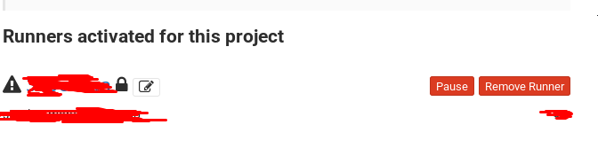

# Project 003: GitLab CICD Pipeline

This project will show you how to setup a Gitlab CICD pipeline, which will build the source code to a docker image and push it to the container registry in GitLab and then re-deploy the docker container with the latest image in your local host.

## Project Goal

Understand how to setup/configure Gitlab as CICD pipeline. Familarize with gitlab pipeline.

## Prerequisites

- Ubuntu 20.04 OS (Minimum 2 core CPU/8GB RAM/30GB Disk)
- Docker
- Docker Compose

## Troubleshooting

## Issue 1: check that a DNS record exists for this domain

Error out when starting up or reconfigure the gitlab server

```dos
RuntimeError: letsencrypt_certificate[gitlab.mydevopsrealprojects.com] (letsencrypt::http_authorization line 6) had an error: RuntimeError: acme_certificate[staging] (letsencrypt::http_authorization line 43) had an error: RuntimeError: ruby_block[create certificate for gitlab.mydevopsrealprojects.com] (letsencrypt::http_authorization line 110) had an error: RuntimeError: [gitlab.mydevopsrealprojects.com] Validation failed, unable to request certificate, Errors: [{url: https://acme-staging-v02.api.letsencrypt.org/acme/chall-v3/4042412034/SuXaFQ, status: invalid, error: {"type"=>"urn:ietf:params:acme:error:dns", "detail"=>"DNS problem: NXDOMAIN looking up A for gitlab.mydevopsrealprojects.com - check that a DNS record exists for this domain; DNS problem: NXDOMAIN looking up AAAA for gitlab.mydevopsrealprojects.com - check that a DNS record exists for this domain", "status"=>400}} ]
```

**Solution:**
Sometimes it will occur when letsencrypt is requesting for a old/used DNS record. Just give it another 15 mins to see if it will figure it out by itself. If no, You can try to reconfigure/restart the gitlab server without any change. If it doesn't work either, you can replace your gitlab domain name in `docker-compose.yaml` with more unique name and then reconfigure/restart your gitlab server.

## Issue 2: Cannot register gitlab-runner: connection refused

When running `gitlab-register`, it shows below error:

```dos
ERROR: Registering runner... failed                 runner=GR1348941oqts-yxX status=couldn't execute POST against https://gitlab.mydevopsrealprojects.com/api/v4/runners: Post "https://gitlab.mydevopsrealprojects.com/api/v4/runners": dial tcp 0.0.0.0:443: connect: connection refused
```

**Solution:**
Make sure to follow step 4 to regerate a new certificate with proper info and update it in gitlab-runner host/container

## Issue 3: Cannot login docker registry: x509: certificate signed by unknown authority

Cannot `docker login` to the gitlab container registry. Below error is returned

```dos
$ docker login registry.gitlab.mydevopsrealprojects.com:5005
Username: root
Password: 
Error response from daemon: Get "https://registry.gitlab.mydevopsrealprojects.com:5005/v2/": x509: certificate signed by unknown authority
```

**Cause:**
You are using a self-signed certificate for your gitlab container registry instead of the certificate issued by a trusted CA. The docker daemon doesnot trust the self-signed cert which causes this error

**Solution:**
You must instruct docker to trust the self-signed certificate by copying the self-signed certificate to `/etc/docker/certs.d/<your_registry_host_name>:<your_registry_host_port>/ca.crt` on the machine where running the docker login command.

```dos
export YOUR_GITLAB_DOMAIN=mydevopsrealprojects.com
export YOUR_GITLAB_CONTAINER=<Gitlab Container ID>

sudo mkdir -p /etc/docker/certs.d/registry.gitlab.$YOUR_GITLAB_DOMAIN:5005
sudo docker cp $YOUR_GITLAB_CONTAINER:/etc/gitlab/ssl/ca.crt /etc/docker/certs.d/registry.gitlab.$YOUR_GITLAB_DOMAIN:5005
```

## Issue 4: x509: certificate signed by unknown authority

when running `gitlab-runner registry`, failing with below error

```dos
ERROR: Registering runner... failed                 runner=GR1348941oqts-yxX status=couldn't execute POST against https://gitlab.mydevopsrealprojects.com/api/v4/runners: Post "https://gitlab.mydevopsrealprojects.com/api/v4/runners": x509: certificate signed by unknown authority
```

> Refer to:
> <https://www.ibm.com/docs/en/cloud-paks/cp-management/2.2.x?topic=tcnm-logging-into-your-docker-registry-fails-x509-certificate-signed-by-unknown-authority-error>
> <https://7thzero.com/blog/private-docker-registry-x509-certificate-signed-by-unknown-authority>

## Issue 5: This job is stuck because the project doesn't have any runners online assigned to it

When running the gitlab pipeline, the job gets stuck with below error

```dos
This job is stuck because the project doesn't have any runners online assigned to it
```

**Cause:**
Check if any gitlab runner is online. If so, most likely the job is stuck because your unners have tags but your jobs don't.

**Solution:**
You need to enable your runner without tags. Go to your project and go to "Settings" -> "CI/CD" -> Click the online gitlab runner -> Check "Indicates whether this runner can pick jobs without tags". Then your pipeline should be able to pick this runner.

> Refer to: <https://stackoverflow.com/questions/53370840/this-job-is-stuck-because-the-project-doesnt-have-any-runners-online-assigned>

## Issue 6: New runner. Has not connected yet

**Cause:**
sometimes you might see the waring icon at the left side of runner. It is due to unverified runner been setup.



**Solution:**

```dos
docker exec -it $(docker ps -f name=gitlab-runner -q) bash
gitlab-runner verify --delete
```

> Refer to: <https://gitlab.com/gitlab-org/gitlab-runner/-/issues/3750>

## Vagrant home

- Windows

`c:\devbox`

- Mac

`~/devbox`

## Environments

| #  | Env  | Y/N  | Recommended   |  Comment |
|---|---|---|---|---|
| 1 | Windows only | ? | ? |   |
| 2 | Windows + Ubuntu | Y | Y |   |
| 3 | Mac only | N | N |   |
| 4 | Mac + Ubuntu | Y | Y |   |

[Windows Only](01_N_WindowsOnly.md)

[With_Windows_Ubuntu](02_Y_Windows_Ubuntu.md)

[Mac Only](03_YN_MacOnly.md)

[With_Mac_Ubuntu](04_YN_Mac_Ubuntu.md)

## My troubleshooting

### [Windows] 0.0.0.0:5005 issue

```dos
C:\CodeUdemy\udemy-devops-9projects-free\003-GitlabCICD>docker compose up -d
[+] Running 2/3
 - Container 003-gitlabcicd-web-1            Starting                                                                                                                                                                        2.2s
 - Container 003-gitlabcicd-gitlab-runner-1  Started                                                                                                                                                                         2.2s
 - Container 003-gitlabcicd-hello-world-1    Running                                                                                                                                                                         0.0s
Error response from daemon: Ports are not available: exposing port TCP 0.0.0.0:5005 -> 0.0.0.0:0: listen tcp 0.0.0.0:5005: bind: An attempt was made to access a socket in a way forbidden by its access permissions.
```

Root cause: 5005 was blocked by Windows

```dos
C:\>netsh interface ipv4 show excludedportrange protocol=tcp 

Protocol tcp Port Exclusion Ranges

Start Port    End Port
----------    --------
      1045        1144
      1145        1244
      4523        4622
      4823        4922
      4923        5022
      7098        7197
      7198        7297
     14365       14464
     14765       14864
     14865       14964
     16826       16925
     16993       17092
     50000       50059     *

* - Administered port exclusions.
```

Solution: change to a different port

in `docker-compose.xml`:

```yml
      - '5055:5005'
```

```dos
C:\CodeUdemy\udemy-devops-9projects-free\003-GitlabCICD>docker compose up -d
[+] Running 3/3
 - Container 003-gitlabcicd-gitlab-runner-1  Started                                                                                                                              12.1s 
 - Container 003-gitlabcicd-hello-world-1    Started                                                                                                                              12.4s 
 - Container 003-gitlabcicd-web-1            Started                                                                                                                              12.4s 
```

### [GitLab] Set the initial root password

```yml
    image: 'gitlab/gitlab-ce:latest'
    restart: always
    hostname: 'gitlab.mydevopsrealprojects.com'
    environment:
      GITLAB_ROOT_PASSWORD: "Password2023#"
      EXTERNAL_URL: "http://gitlab.mydevopsrealprojects.com"
      GITLAB_OMNIBUS_CONFIG: |
        gitlab_rails['initial_root_password'] = "Password2023#"
        gitlab_rails['store_initial_root_password'] = true
        gitlab_rails['display_initial_root_password'] = true
    ports:
```

### [GitLab] 422

Clear the cookie and cache, then restart Chrome!
