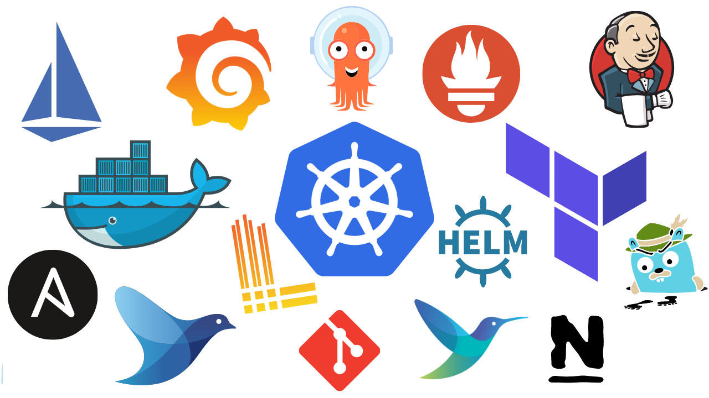

# DevOps Labs: 3 Real DevOps Projects

Enjoy 😀

## Course

[DevOps Labs: 3 Real DevOps Projects](https://www.udemy.com/course/devops-labs-9-real-devops-projects-free-version/)

<a href="https://www.udemy.com/course/devops-labs-9-real-devops-projects-free-version/"></a>

## Labs

- Lab 001: ELK Monitoring
- Lab 002: Jenkins CICD Pipeline
- Lab 003: Gitlab CICD Pipeline

## More labs (WIP)

```dos
Lab 004: Deploy Docker with Terraform Script
Lab 005: Vault Jenkins Pipeline
Lab 006: Push War file to Nexus Repository Via Jenkins Pipeline and Deploy to Tomcat in Vagrant VM
Lab 007: Managing SSH Access with Vault
Lab 008: Install Jenkins Using Ansible
Lab 009: Helm Deployment in Kubernetes
Lab 010: Deploy Prometheus/Grafana on Minikube and Monitor The Health of Containers and VMs
Lab 011: Create Read Only Kubeconfig File
Lab 012: Backup Vault in Minio
Lab 013: Develop a Java Application in K8s for Monitoring ConfigMap Modifications and Content Changes
Lab 014: Deploy and Use Vault As Agent Sidecar Injector
```

## Youtube channel

[My Youtube channel](https://www.youtube.com/@devopswithbrian2283)
